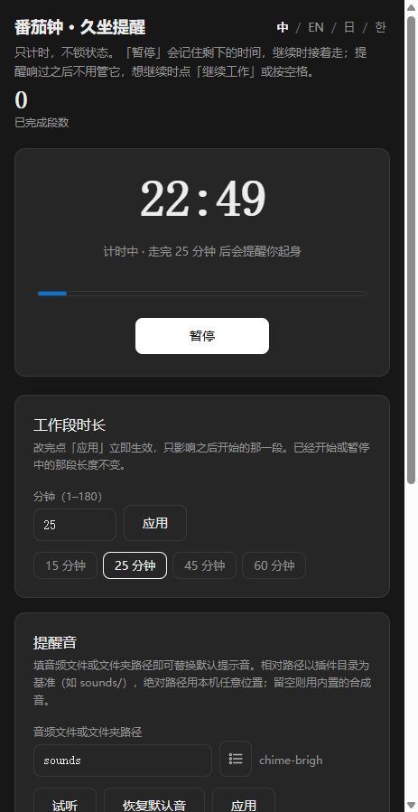

# Pomodoro Sit Reminder

English | [简体中文](README.zh-CN.md)

A Pomodoro timer that only counts. When a work segment ends it shows an in-page sit reminder and plays a sound, but it never locks the timer and never enforces a rest length — walk away for as long as you like, then press **继续** to start the next segment.

Author: [1602WinXP](https://github.com/1602WinXP) · Version: `1.0.0`

*Both captured in MiniMax Code on Windows at a 463 px panel width, with the session statistics cleared to zero so no personal data is shown. The reminder sound is the bundled `sounds/` folder, playing in sequence with loudness matching on; the app is in dark mode.*

## What it does

- **Work segment** — 1–180 minutes, with 15 / 25 / 45 / 60 presets.
- **Sit reminder** — fires when the segment elapses, in the page only. No notification permission, no lock screen, no forced break.
- **Continue** — one button starts the next segment whenever you are ready.
- **Stats** — completed segments and total focus time, with a clear button.
- **Reminder sound** — a single audio file or a whole folder, in sequence or shuffled, with single-track loop and loudness matching. See below.
- **界面语言** — 中文 / English / 日本語 / 한국어.
- **配色** — follow system / light / dark.

## Install and use

Copy this whole directory, including the hidden `.minimax-plugin` directory, into `.minimax/plugins/` inside your home folder:

| System | Target path |
| --- | --- |
| Windows | `C:\Users\<username>\.minimax\plugins\pomodoro-sit-timer` |
| macOS | `/Users/<username>/.minimax/plugins/pomodoro-sit-timer` |
| Linux | `/home/<username>/.minimax/plugins/pomodoro-sit-timer` |

`.minimax` is hidden: enable "Show hidden items" in File Explorer, or press `Cmd + Shift + .` in Finder. If MiniMax Code has run before, the folder already exists. If you use a custom data directory (`MINIMAX_DATA_DIR`), put the plugin under `plugins/` there instead.

Restart MiniMax Code, confirm the plugin is enabled, then open "番茄钟 · 久坐提醒" or ask the Agent to open it.

To update, close the app, exit MiniMax Code, and replace the whole plugin directory. To uninstall, do the same and delete the directory; app data stored outside it may remain.

## Reminder sound

The sound path box accepts either a **single file** or a **folder**. A folder is scanned one level deep, keeps `.mp3` / `.wav` / `.ogg` only, and is sorted by name so that `2.mp3` comes before `10.mp3`.

- **顺序 / 随机** — the icon button next to the path box toggles between the two. Shuffle reorders the whole folder each time you get through it, so a pass never repeats a track and never skips one.
- **单曲循环** — locks playback to one file. The lock lives on the server, so the file plays once per reminder and stays put across restarts. While it is on, the mode button is disabled.
- **音量标准化** — on by default. Every track's peak is matched to one shared reference, measured from the first track you played and clamped to 0.25–0.89, so a quiet folder and a loud folder play at the same level. Gain is capped at 40× and near-silent files are left alone. Turning it on re-measures from whatever plays next.
- **试听** — plays the next file in the running order rather than the one that is armed, so you can walk the whole folder. It does not change what the next real reminder will play.
- **恢复默认音** — clears the path and falls back to the built-in chime.

A path such as `sounds` is resolved against the installed plugin directory. Because the client runs from a fresh temporary copy on every start, relative paths are re-resolved at launch rather than saved as absolute ones — an absolute path saved earlier would point at a directory that no longer exists.

Three sample tones ship in `sounds/` (`chime-soft`, `chime-bright`, `chime-deep`).

## Tested environment

MiniMax Code desktop **3.1.1** on Windows (10.0.26200, x64). The repository's own docs are written against 3.0.73; this package was built and tested on 3.1.1.

Verified during development, in the client's own embedded browser at a 463 px viewport: install and open; countdown across 1 / 15 / 25 / 45 / 60 minutes; the reminder firing with sound; 继续 starting the next segment; stats and clearing them; folder playback in both sequence and random order; the single-track lock; a relative sound path still resolving after a client restart; loudness matching; all four interface languages; all three colour modes.

**Unverified:** macOS and Linux. The audio path handling, the temporary-directory resolution and the layout have not been exercised on either.

## Data & access

- **Files read** — the audio file or folder you type into the sound box, read-only. The runtime also reads `sounds/` inside the installed plugin directory for the bundled samples. Nothing else on disk is touched; there is no scanning of your music library.
- **Files written** — one `state.json` in the Host-provided `context.dataDir`, holding the duration, phase, remaining time, completed-segment count, accumulated focus seconds, and your sound settings. It is written atomically (temp file in the same directory, then rename) and the directory layout is treated as opaque.
- **Browser storage** — view preferences only: interface language, colour mode, whether loudness matching is on, and the measured reference level. No timer or session data.
- **Network** — none. The runtime makes no outbound requests and has no telemetry.
- **Subprocesses** — none.
- **Configuration** — no API key, no account, no setup.

The page shows only your own timer and your own stats. Because the reminder is in-page, a segment that ends while the MiniApp tab is in the background may go unnoticed until you look at it again.

## Source and verification

The page is `miniapp/client/index.html` (no framework, no CDN, no build step — it works offline), the Node entry is `miniapp/node/server.mjs`, and the Host API type definitions used for editor type-checking are in `miniapp/node/miniapp-api.ts`. There are no third-party runtime dependencies.

## License

[MIT](LICENSE).
